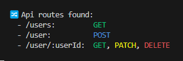

# console-express-routes [](https://github.com/yutak23/console-express-routes/actions/workflows/test.yaml)

As follows, output logs the routes registered with the Express.



## Installation

### npm

```sh
$ npm install console-express-routes
```

### yarn

```sh
$ yarn add console-express-routes
```

## Usage

### TypeScript

```ts
import express from 'express';
import consoleExpressRoutes from 'console-express-routes';

const app = express();

app.get('/', (req: Request, res: Response) => {
	...
});
...
app.listen(3000, () => {
	console.log('Example app listening on port 3000!');
    consoleExpressRoutes(app);
});
```

### JavaScript

#### ES Module

```js
import express from 'express';
import consoleExpressRoutes from 'console-express-routes';

const app = express();

app.get('/', (req, res) => {
	...
});
...
app.listen(3000, () => {
	console.log('Example app listening on port 3000!');
    consoleExpressRoutes(app);
});
```

#### CommonJS

Note that you should be `require('...').default`.

```js
const express = require('express');
const consoleExpressRoutes = require('console-express-routes').default;

const app = express();

app.get('/', (req, res) => {
	...
});
...
app.listen(3000, () => {
	console.log('Example app listening on port 3000!');
    consoleExpressRoutes(app);
});
```

## License

[MIT licensed](./LICENSE)
